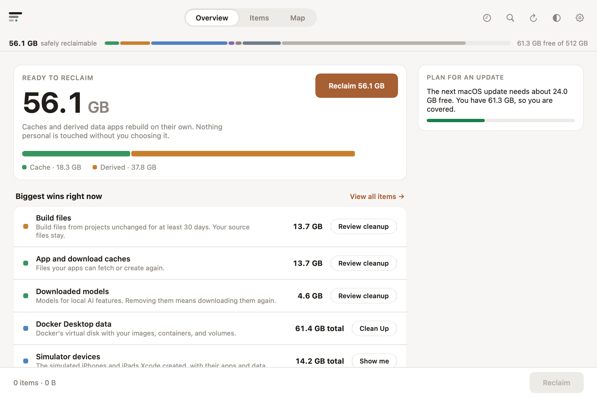
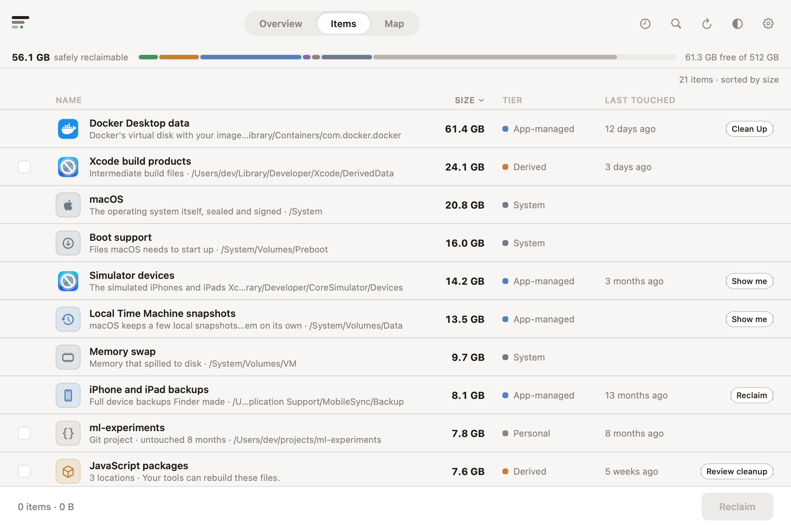
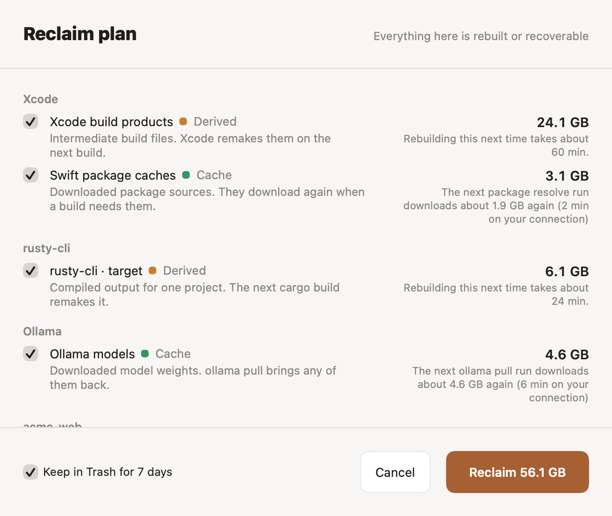
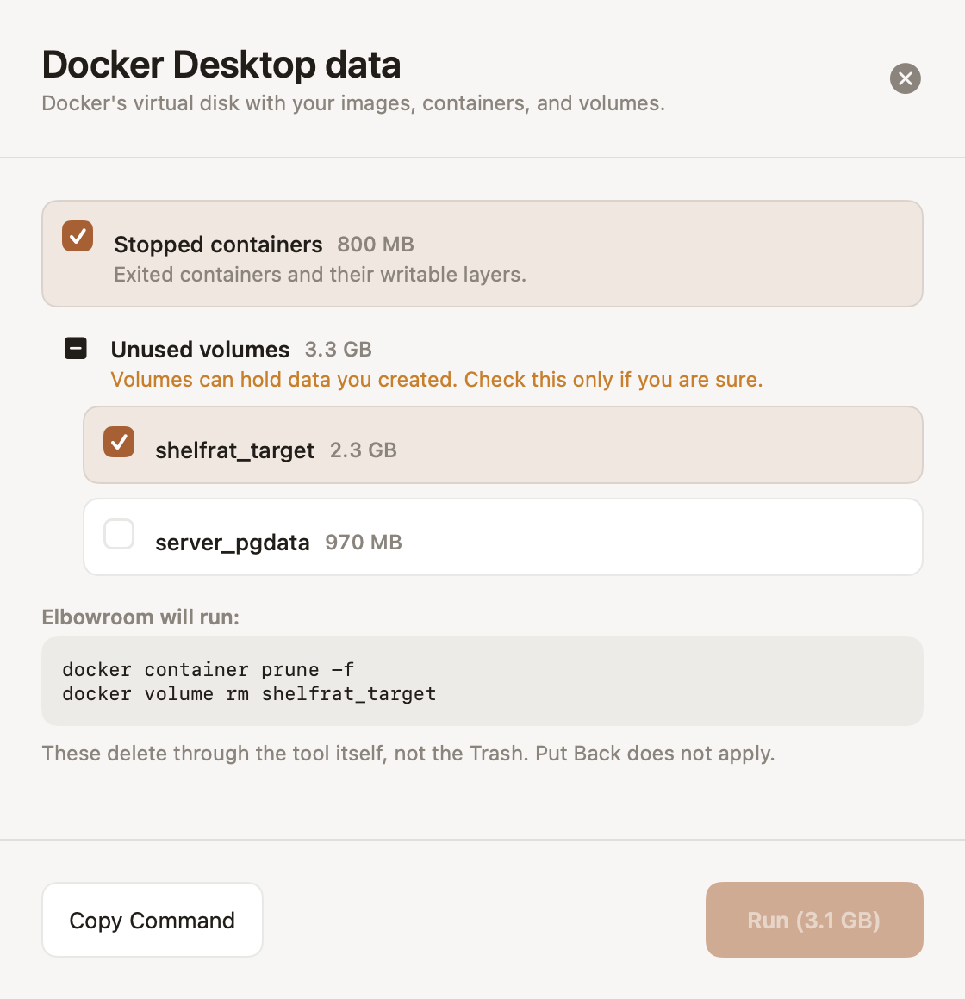

# Elbowroom

**Room to build.** Elbowroom explains every gigabyte on a small-disk Mac and
reclaims what regenerates. Native macOS and SwiftUI, with Sparkle for signed automatic updates.

The premise: a full developer disk is a comprehension problem wearing a storage
costume. Nobody tells you that a simulator runtime is a re-downloadable OS
image or that `target/` rebuilds itself. Elbowroom names things, rates them for
safety, and acts only with informed consent — explanation before action,
receipts after it. Six types govern everything: **Cache** (refills itself),
**Derived** (your tools remake it), **App-managed** (another app owns it;
Elbowroom opens its controls or runs its tool), **Apps** (applications plus the
data they keep; uninstalling asks about both), **Personal** (untouchable),
**System** (macOS itself — explained, never gray, with the lever named where
one exists).

Working rules for contributors and agents live in [`CLAUDE.md`](CLAUDE.md).

Elbowroom is distributed directly with Developer ID signing and notarization.
All features are free with no usage cap, paid tier, or purchase flow.
Mac App Store distribution, App Sandbox, and external-drive offloading are not supported.
The original product spec and vision doc are retired; they remain in git
history (`docs/`, removed 2026-07).

## Build & run

```sh
swift build                      # debug build
swift test                       # engine, atlas, planners, tool parsers, copy rules (en+ja)
swift run ElbowroomSnapshots        # design-QA fixture renders → Design/snapshots/ (both appearances)
Scripts/make-app.sh              # dist/Elbowroom.app, unsandboxed; stable signing identity keeps TCC grants across rebuilds
open dist/Elbowroom.app
```

Requires Xcode 16+ / Swift 5.10+ on macOS 14+ (Explain needs macOS 26 with
Apple Intelligence; it hides itself elsewhere). `open Package.swift` works in
Xcode too.

Regenerable assets: `Scripts/gensounds.py` (UI sounds),
`Scripts/genicon.swift` (app icon → `Assets/AppIcon.icns`).

## Install and release

Open the DMG, drag Elbowroom to Applications, and launch it from there.
All features are free. Release downloads support Apple Silicon and Intel Macs.

The [release guide](docs/RELEASING.md) covers Dorso-style installer previews,
semantic version bumps, changelog entries, notarization, and automatic updates.

```sh
./test-dmg.sh                    # local installer preview
./release.sh 1.1.0               # signed, notarized DMG + ZIP; stays local
# Merge a version bump + changelog into main to publish through GitHub Actions.
```

Version/build metadata lives in `release.json`; release notes come from
`CHANGELOG.md`. Developer builds do not start the automatic updater.

## Layout

```
Sources/ElbowroomKit/
  Copy/                        CopyDeck (every string) + Loc + ja-JP table
  DesignSystem/Tokens.swift    Warm Instrument tokens: warm neutrals, terracotta
                               brand, four tier data colors (CVD-validated)
  Models/                      Tier, ScanNode, AtlasEntry/Item, Atlas packs
  Engine/                      ScanEngine + BulkWalk (getattrlistbulk walk,
                               worker pool), DiskInfo, FSWatcher, ScanCache,
                               AskKibi (on-device model)
  Lenses/                      Detectors that name "Everything else" (media
                               piles, installers, twins, VMs, weights, games)
  Reclaim/                     Plan + trash-first executor + receipts
  Steward/UpdatePlanner.swift  Greedy update-plan composition
  Tools/                       Tool-mediated cleanup: simctl, docker, brew,
                               tmutil (snapshots) — literal-command sheets
  Support/                     TeachFlows, ChangeLog, stores,
                               sounds, local-only analytics, Fixtures
  Components/                  TierChip, ByteCounter, DiskStrip, LegendPanel…
  Views/                       Onboarding, Overview, Map (squarified treemap),
                               Items, History, sheets, Settings
Sources/Elbowroom/ElbowroomApp.swift App entry: window, Settings, Steward menu bar
Sources/ElbowroomSnapshots/       Offscreen fixture renderer for design QA
Sources/ElbowroomBench/           Scan benchmark + bulk-read diagnostic harness
Tests/ElbowroomTests/             Engine, tool parsers, bilingual copy-rule
                               audits
```

## Architecture and performance

[Architecture](Design/architecture.md) describes ownership, I/O boundaries, and
how to add integrations. [Performance](Design/performance.md) documents repeatable
release benchmarks and the measured tradeoffs.

```sh
swift run -c release ElbowroomBench metrics /path/to/fixture --items 10000 --iters 5
swift run -c release ElbowroomSnapshots /tmp/elbowroom-ui --performance --items 10000
```

The UI harness uses isolated stores and an offscreen window. It measures launch,
search, scrolling layout, and cache restore without opening the live app.

## Product shape (current)

- **Views:** Overview (briefing: hero headroom, biggest wins, side cards) ·
  Map (honest squarified treemap, area ∝ bytes) · Items (a flat table that combines related storage
  across locations into one row) · History (weekly deltas). A persistent Disk Strip
  shows the live headroom figure.
- **Scan:** read-only bulk-attribute walk with FSEvents deltas; purgeable and
  snapshots measured and labeled; denied paths disclosed, never silently
  skipped.
- **Atlas packs:** Xcode, JavaScript, Rust, Homebrew, Docker/OrbStack, system
  residue (device backups, snapshots, app caches), ML weights. Lenses name
  the long tail (findings are ordinary items). Recognized groups also include
  pip, uv, and Gradle caches, plus Music, TV, iMovie, Final Cut Pro, and Aperture
  library bundles. Personal libraries are explained without deletion suggestions.
  “Everything else” is a recognition backlog: naming more storage is valuable
  even when it cannot be recommended for cleanup.
- **Reclaim:** informed-consent plan, Trash-first, receipts + CSV + Put Back,
  no reclaim limits or paid upgrades.
- **Tool-mediated cleanup:** where the owning tool can do it safely (simctl,
  docker, brew, tmutil for Time Machine local snapshots), Elbowroom shows the
  literal commands, runs them one at a time, and writes measured receipts.
  Snapshot deletion carries backup-destination reassurance and an opt-in
  auto-trim (macOS removed its own off switch).
- **Applications:** supported caches have their own cleanup items. Each app
  is an item whose remaining size includes its `~/Library`
  residue (App Support, Caches, Containers, and friends, matched
  conservatively by bundle id or exact name). Uninstall opens the ordinary
  trash-first plan — the bundle plus one row per residue location, each the
  user's to uncheck.
- **System:** the container's sibling volumes become items — macOS itself,
  the update staging area (with a Software Update door), and swap — so the
  ~40 GB no file walk can see is named instead of gray.
- **Steward:** update planner ("macOS needs 22 GB; here's the plan"), quiet
  notification budget.
- **Explain:** on-device model describes unknown folders ≥ 500 MB; guesses
  are visually hedged and never count toward promises.
- **Localization:** full English + Japanese, copy rules test-enforced in both.

## Screenshots

<picture>
  <source media="(prefers-color-scheme: dark)" srcset="docs/images/overview-dark.png">
  
</picture>

<picture>
  <source media="(prefers-color-scheme: dark)" srcset="docs/images/items-dark.png">
  
</picture>

<picture>
  <source media="(prefers-color-scheme: dark)" srcset="docs/images/reclaim-plan-dark.png">
  
</picture>

<picture>
  <source media="(prefers-color-scheme: dark)" srcset="docs/images/cleanup-docker-dark.png">
  
</picture>

## Design language

Warm Instrument: warm neutrals with one terracotta action color; tier colors
appear only where tier is the message (dot + word, never color alone).
SF Pro with tabular figures, SF Mono for paths and commands. Borders over
shadows. No mascot; the signature view is the treemap. Verify visual changes
with `swift run ElbowroomSnapshots` before shipping.

## Remaining external steps (not code)

- **Distribution:** merge a version bump and changelog into `main`; the GitHub Release workflow tests, signs, notarizes, and publishes it.
- **Japanese review:** the ja table is authored for native review before
  release.
