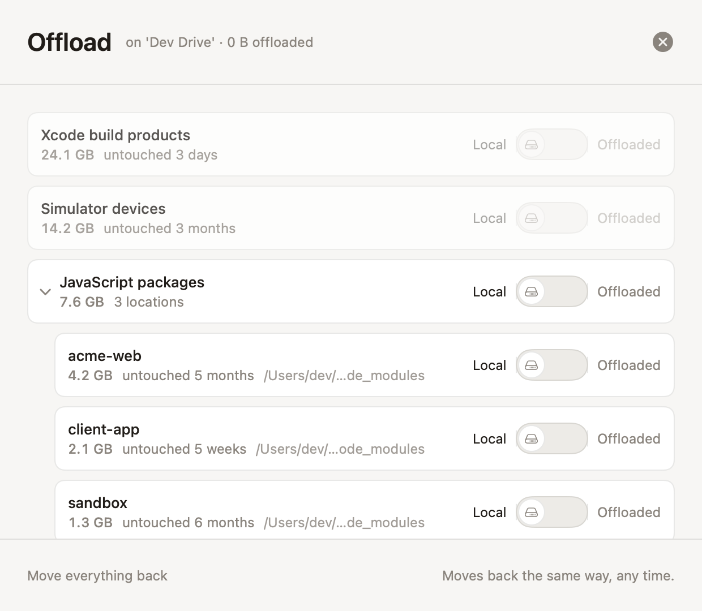

# Elbowroom

**Room to build.** Elbowroom explains every gigabyte on a small-disk Mac,
reclaims what regenerates, and offloads the rest to an external drive.
Native macOS, SwiftUI, no dependencies, nothing leaves your machine.

<picture>
  <source media="(prefers-color-scheme: dark)" srcset="docs/images/overview-dark.png">
  
</picture>

## The premise

A full developer disk is a comprehension problem wearing a storage costume.
Nobody tells you that a simulator runtime is a re-downloadable OS image, that
`DerivedData` remakes itself on the next build, or that Docker's 60 GB virtual
disk is mostly reclaimable from inside Docker. Elbowroom names these things,
rates them for safety, and acts only with informed consent: explanation before
action, receipts after it.

Four tiers govern everything:

- **Regenerable**: refills itself (caches, package registries).
- **Rebuildable**: your tools remake it (`DerivedData`, `target/`, `node_modules`).
- **Managed**: another app owns it; Elbowroom opens that app's controls or runs
  its official tool.
- **Yours**: untouchable. Never suggested, never counted in promises.

## How it differs from DaisyDisk and the others

Disk mappers (DaisyDisk, GrandPerspective, OmniDiskSweeper) answer *what is
big*. They hand you a beautiful map and a delete key, and then it is your job
to know whether `CoreSimulator/Devices` is safe to remove. One-button cleaners
(CleanMyMac and friends) go the other way: they promise a number, delete by
private rulebook, and you find out later what the button meant.

Elbowroom answers the question in between, the one that actually stalls you:
*what is this, and what happens if it goes away?*

- **It knows what things are.** An atlas of developer and system storage
  (Xcode, JavaScript, Rust, Homebrew, Docker/OrbStack, ML weights, device
  backups, Time Machine local snapshots) names each item in plain language,
  with the cost of regeneration measured, not guessed: "Rebuilding this next
  time takes about 60 min."
- **It shows the literal command.** Where the owning tool can clean up safely,
  Elbowroom runs `simctl`, `docker`, `brew`, or `tmutil` and shows you the
  exact command first. Copy it and run it yourself if you prefer; the result
  is identical.
- **It deletes nothing behind a tool's back.** No reaching into Docker's
  virtual disk or Xcode's caches with `rm`. Managed data goes through the
  manager.
- **Trash first, receipts after.** Reclaims move to the Trash with Put Back
  intact, then a receipt records what was removed and how much space actually
  came back. Measured, not promised.
- **It can offload instead of delete.** Journaled copy, verify, then
  symlink-swap moves cold projects to an external APFS drive, crash-safe at
  every boundary, reversible with one switch.
- **Private by construction.** The scan is read-only and touches no network.
  Explanations from the on-device model are visibly hedged as guesses and
  never count toward the reclaimable number.

<picture>
  <source media="(prefers-color-scheme: dark)" srcset="docs/images/cleanup-docker-dark.png">
  
</picture>

## What it looks like

**Items** is the dense table and the accessibility backbone: every finding
with size, tier, last-touched date, and the honest path.

<picture>
  <source media="(prefers-color-scheme: dark)" srcset="docs/images/items-dark.png">
  
</picture>

**Reclaim plans** spell out what each removal costs before you commit.

<picture>
  <source media="(prefers-color-scheme: dark)" srcset="docs/images/reclaim-plan-dark.png">
  
</picture>

**Offload** moves cold, heavy folders to an external drive and back again the
same way, any time.

<picture>
  <source media="(prefers-color-scheme: dark)" srcset="docs/images/offload-dark.png">
  
</picture>

Other views: **Map** (an honest squarified treemap, area proportional to
bytes, tint by tier) and **History** (weekly deltas). A persistent disk strip
keeps the live headroom figure in sight, and a Steward plans for updates:
"macOS needs 22 GB; here's the plan."

Full English and Japanese localization, copy rules test-enforced in both.

## Build & run

```sh
swift build                        # debug build
swift test                         # engine, atlas, planners, stash crash matrix, tool parsers, copy rules (en+ja)
swift run ElbowroomSnapshots       # design-QA fixture renders to Design/snapshots/ (both appearances)
Scripts/make-app.sh                # dist/Elbowroom.app, unsandboxed; stable signing identity keeps TCC grants across rebuilds
Scripts/make-app.sh release --sandbox   # signed + App Sandbox entitlements (App Store shape)
open dist/Elbowroom.app
```

Requires Xcode 16+ / Swift 5.10+ on macOS 14+ (Explain needs macOS 26 with
Apple Intelligence; it hides itself elsewhere). `open Package.swift` works in
Xcode too.

Regenerable assets: `Scripts/gensounds.py` (UI sounds),
`Scripts/genicon.swift` (app icon to `Assets/AppIcon.icns`).

Working rules for contributors and agents live in [`CLAUDE.md`](CLAUDE.md).

## Layout

```
Sources/ElbowroomKit/
  Copy/                        CopyDeck (every string) + Loc + ja-JP table
  DesignSystem/Tokens.swift    Warm Instrument tokens: warm neutrals, terracotta
                               brand, four tier data colors (CVD-validated)
  Models/                      Tier, ScanNode, AtlasEntry/Item, Atlas packs
  Engine/                      ScanEngine + BulkWalk (getattrlistbulk walk,
                               worker pool), DiskInfo, FSWatcher, ScanCache,
                               AskKibi (on-device model)
  Lenses/                      Detectors that name "Everything else" (media
                               piles, installers, twins, VMs, weights, games)
  Reclaim/                     Plan + trash-first executor + receipts
  Stash/                       Manifest, journaled move state machine,
                               Guardian, speed test
  Steward/UpdatePlanner.swift  Greedy update-plan composition
  Tools/                       Tool-mediated cleanup: simctl, docker, brew,
                               tmutil (snapshots), literal-command sheets
  Support/                     TeachFlows, ChangeLog, stores, purchases,
                               sounds, local-only analytics, Fixtures
  Components/                  TierChip, ByteCounter, DiskStrip, StashToggle...
  Views/                       Onboarding, Overview, Map (squarified treemap),
                               Items, History, sheets, Settings
Sources/Elbowroom/ElbowroomApp.swift   App entry: window, Settings, Guardian menu bar
Sources/ElbowroomSnapshots/    Offscreen fixture renderer for design QA
Sources/ElbowroomBench/        Scan benchmark + legacy-walk A/B harness
Tests/ElbowroomTests/          Engine, stash kill -9 recovery matrix, tool
                               parsers, bilingual copy-rule audits
```

## Design language

Warm Instrument: warm neutrals with one terracotta action color; tier colors
appear only where tier is the message (dot + word, never color alone).
SF Pro with tabular figures, SF Mono for paths and commands. Borders over
shadows. No mascot; the signature view is the treemap. Verify visual changes
with `swift run ElbowroomSnapshots` before shipping.

## Remaining external steps (not code)

- **App Store Connect:** create the `io.elbowroom.pro` IAP so StoreKit returns
  a product; notarize the Developer ID build for distribution outside the
  store.
- **Stash walkthrough on hardware:** the full-disk grant, offload, unplug,
  reconcile loop on a physical external drive, once per release.
- **Japanese review:** the ja table is authored for native review before
  submission.
