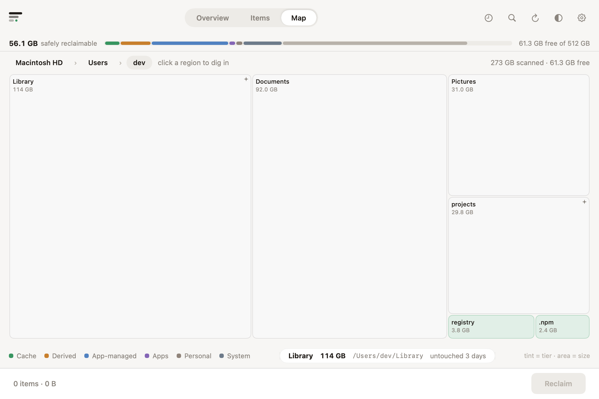

# Elbowroom

**Room to build.** Elbowroom shows what is taking up space on your Mac, explains
what it belongs to, and helps you reclaim files your tools can regenerate.
Every feature is free, with no subscriptions or cleanup limits.

[Download the latest release](https://github.com/tldev/elbowroom/releases/latest)
· [Release notes](CHANGELOG.md)

## Install

Open the DMG, drag **Elbowroom** to **Applications**, and launch it from there.
The app guides you through Full Disk Access when needed to scan protected folders.

Requires **macOS 14 or later**, on Apple Silicon or Intel. Downloads are signed
with Developer ID and notarized by Apple. Built-in update checks keep you informed
of new releases; you choose when to install them.

## What it does

- **Explain disk usage.** Overview highlights cleanup opportunities, Items groups
  related storage across folders, and Map shows a treemap sized by disk usage.
  History tracks changes over time.
- **Recognize developer storage.** Find Xcode build products and simulators,
  JavaScript dependencies, Rust build output, Homebrew downloads, Docker data,
  Python and Gradle caches, and downloaded model weights.
- **Review before reclaiming.** See what each item is, what removing it means,
  and whether it will need rebuilding or downloading again. Choose the items
  to remove, with receipts and CSV export afterward.
- **Use the owning tool.** Docker, Homebrew, simulators, and local Time Machine
  snapshots have cleanup flows that show the exact commands before running them.
- **Understand apps and system storage.** Review applications and their associated
  data, recognize personal libraries, and see explanations for macOS, swap, and
  other system volumes. Uninstall plans let you choose which related files go.
- **Plan for updates.** Check whether there is enough space for a macOS update
  and review a cleanup plan when more room is needed.

File cleanup uses the Trash where supported, with Put Back for recoverable items.
Tool-driven deletion explains when the Trash and Put Back do not apply. Personal
files require your explicit choice; a scan alone never deletes anything.

The interface is available in English and Japanese. **Explain** can describe
unrecognized large folders using an on-device model on Macs with macOS 26 and
Apple Intelligence available. Its suggestions are presented as guesses and never count toward reclaimable space.

## Screenshots

These views use sample data rendered by the app, in light and dark appearance.

### Overview

Disk usage, cleanup opportunities, and space for the next update.

<picture>
  <source media="(prefers-color-scheme: dark)" srcset="docs/images/overview-dark.png">
  
</picture>

### Items

Related files grouped by purpose, with sizes, explanations, and cleanup actions.

<picture>
  <source media="(prefers-color-scheme: dark)" srcset="docs/images/items-dark.png">
  
</picture>

### Map

A treemap for exploring where the space goes.

<picture>
  <source media="(prefers-color-scheme: dark)" srcset="docs/images/map-dark.png">
  
</picture>

### Review cleanup

Choose what to reclaim and see the cost of rebuilding or downloading it again.

<picture>
  <source media="(prefers-color-scheme: dark)" srcset="docs/images/reclaim-plan-dark.png">
  
</picture>

### Tool-driven cleanup

Review the selected Docker data and the exact commands before execution.

<picture>
  <source media="(prefers-color-scheme: dark)" srcset="docs/images/cleanup-docker-dark.png">
  
</picture>

## Development

Elbowroom is a native macOS app built with SwiftUI and Swift Package Manager.
Use Xcode 26.3, matching CI, for the full build and test setup.

```sh
swift build
swift test
Scripts/make-app.sh             # builds dist/Elbowroom.app
open dist/Elbowroom.app
```

The snapshot renderer uses isolated sample data and stores. It does not scan
your disk or operate the running app.

```sh
swift run ElbowroomSnapshots    # all fixture views → Design/snapshots/
Scripts/update-readme-screenshots.sh
```

- [Architecture](Design/architecture.md): ownership, I/O boundaries, and integrations.
- [Performance](Design/performance.md): repeatable benchmarks and measured tradeoffs.
- [Contributor guidance](CLAUDE.md): product scope, bilingual copy, and working rules.
- [Release guide](docs/RELEASING.md): installer previews, versioning, signing, and recovery.

## Releases

`release.json` owns the semantic version and build number; `CHANGELOG.md` owns
the release notes. Add notes under `[Unreleased]`, then run
`./release.sh --bump patch` (or `minor` / `major`) to prepare a release.

Merging a new version into `main` runs tests, builds universal DMG and ZIP
downloads, signs and notarizes them, publishes the GitHub release, and updates
the Sparkle feed. Merges without a new version do not publish another release.
Use `./test-dmg.sh` for a local installer preview. Developer builds do not start
the automatic updater.
